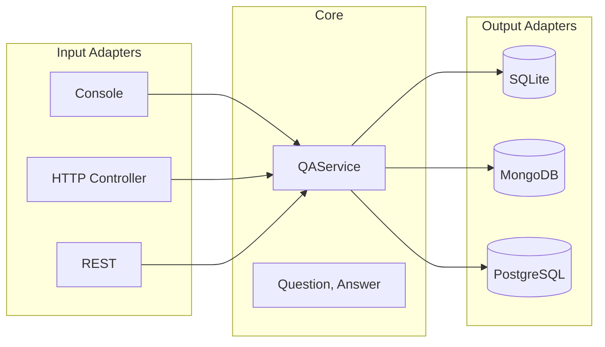
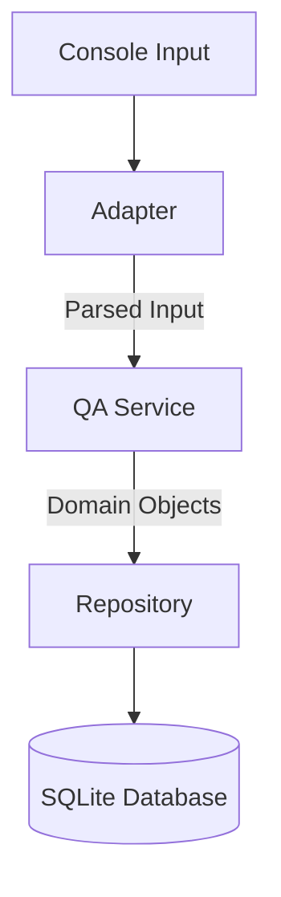

# QA Console Application
[](https://opensource.org/licenses/MIT)

A command-line question-answer system with persistent storage, following clean **hexagonal architecture** principles.

## Features

- 💾 **Persistent storage** using SQLite
- 🔍 **Exact-match question retrieval**
- ➕ **Multi-answer support** per question
- 🛡️ **Input validation** with clear error messages
- 📦 **Self-contained** with no external dependencies

## 🏗️ Architectural Flexibility

### 🔄 Swapping User Interfaces
The application's **core business logic remains unchanged** when changing interfaces. Replace only the input adapter:

| Interface | Adapter Class | Changes Needed |
|-----------|---------------|----------------|
| **Console (Current)** | `ConsoleInputAdapter` | None |
| **Web App** | Create `WebControllerAdapter` | 1. New Spring/HTTP controller<br>2. Keep existing `QAService` |
| **REST API** | Create `RestApiAdapter` | 1. Add HTTP endpoints<br>2. Reuse all domain logic |

```java
// Potential WebAdapter stub
@RestController
public class WebControllerAdapter {
    private final QAService service;

    @PostMapping("/questions")
    public void addQuestion(@RequestBody QuestionRequest request) {
        service.addQuestion(request.toDomain());
    }
}
```


### 💾 Database Agnosticism

Change databases by **only replacing the output adapter**:

|Database|Adapter Class|Changes|
|---|---|---|
|**SQLite (Current)**|`SQLiteQuestionRepository`|None|
|**MongoDB**|`MongoQuestionRepository`|1. Implement `QuestionRepository`  <br>2. Use MongoDB driver|
|**PostgreSQL**|`PostgresQuestionRepository`|1. New JDBC implementation  <br>2. Same repository interface|
```java
// Potential MongoDB adapter
public class MongoQuestionRepository implements QuestionRepository {
    private final MongoCollection<Document> collection;
    
    public List<Answer> findByQuestion(Question question) {
        // MongoDB-specific query
    }
}
```

### Why This Matters

✅ **Future-proof design**  
✅ **Zero core logic changes** when upgrading infrastructure  
✅ **Parallel development** - UI and DB teams can work independently  
✅ **Easy testing** - Mock adapters during development

📌 **Example Migration Path**:

1. Keep `QAService` and domain models

2. Replace `ConsoleInputAdapter` with `WebControllerAdapter`

3. Swap `SQLiteQuestionRepository` for `MongoQuestionRepository`

4. **Result**: Web app with MongoDB, same business rules!



## Architecture


### Key Components

- **Domain**: `Question`, `Answer` value objects

- **Ports**: `InputPort`, `QuestionRepository` interfaces

- **Adapters**: `ConsoleInputAdapter`, `SQLiteQuestionRepository`

- **Core**: `QAService` business logic

### Technology Choices
| Component | Library       | Version      | Rationale                 |
| --------- | ------------- | ------------ | ------------------------- |
| Database  | SQLite JDBC   | 3.49.1       | Lightweight, zero-config  |
| Testing   | JUnit+Mockito | 5.9.1/5.17.0 | Modern Java testing stack |

## 📦 Dependencies

### Runtime
- [SQLite JDBC](https://github.com/xerial/sqlite-jdbc) 3.49.1 - Database driver

### Testing
- [JUnit 5](https://junit.org/junit5/) 5.9.1 - Test framework
- [Mockito](https://site.mockito.org/) 5.17.0 - Mocking library
- [AssertJ](https://assertj.github.io/doc/) 3.27.3 - Fluent assertions

## Quick Start

### Prerequisites
- Java 17+
- Gradle 7.5+

### Installation
```bash
git clone https://github.com/yourusername/qa-console-app.git
cd qa-console-app
```

### Running the Application
```bash
./gradlew run
```

### Usage
### Adding Questions
```text
<question>? "answer1" "answer2"...

Example:
What is Java? "A programming language" "A platform"
```

### Asking Questions
```text
Enter your question:
> How to exit Vim?
:q!
:wq
```

## Development

### Building
```bash
./gradlew build
```

### Testing
```bash
./gradlew test
```

## Configuration

Edit `src/main/java/qa/infrastructure/DatabaseConfig.java`:
```java
//change to inMemory() for testing
DatabaseConfig config = DatabaseConfig.fileBased("qa.db");
```

## FAQ
### Where is data stored?
By default in `./qa.db` (SQLite file).

### How to handle special characters?
Answers support any characters except unclosed quotes.

## License
Distributed under the MIT License. See `LICENSE` for more information.
